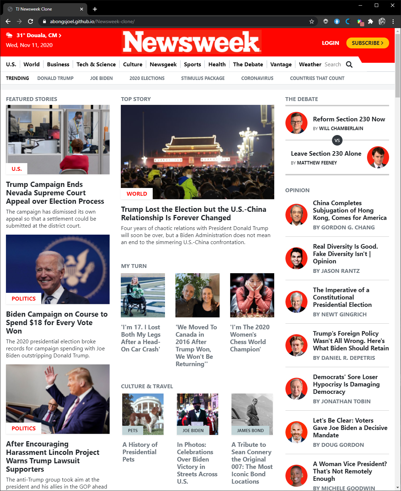

# Newsweek-web Clone

# Creating Newsweek web clone with responsive design and Bootstrap.

This project consists of replicating the Newsweek website using Bootstrap.

- HTML5
- HTML5 semantic
- CSS3
- flex box
- css grid
- styleling
- Bootstrap

In this project we made sure to consider to :

- Use of Bootstrap.
- Align elements with flex and grid.
- Use meadiqueries with 2 breakpoints.

## Built With

- HTML5 
- CSS
- VSC
-  <a href="https://www.w3schools.com/css/" target="_blank"> Bootstrap

## Live Demo

[Live Demo Link](https://raw.githack.com/MrkarlosM/newsweek-clone/Feature-newsweek/index.html)

👤 **Carlos Martinez**

- GitHub: [@MrkarlosM](https://github.com/MrkarlosM)
- Twitter: [@MrkarlosM](@MrkarlosM)
- LinkedIn: [MrkarlosM](https://www.linkedin.com/in/carlos-mario-martinez-b1768355/)

👤 **Heber Lazo**

- [@lazo_heber](https://www.linkedin.com/in/heber-lazo-benza-523266133/) [][linkedin]

- [@lazo_heber](https://twitter.com/lazo_heber) [][twitter]

## 🤝 Contributing

Contributions, issues, and feature requests are welcome!

Feel free to check the [issues page](https://github.com/MrkarlosM/newsweek-clone/issues).

## Show your support

Give a ⭐️ if you like this project!

## 📝 License

This project is [MIT](LICENSE) licensed.

[linkedin]: www.linkedin.com/in/heber-lazo
[twitter]: https://twitter.com/lazo_heber
